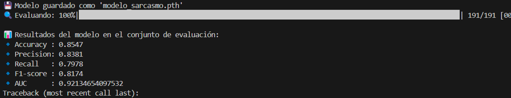
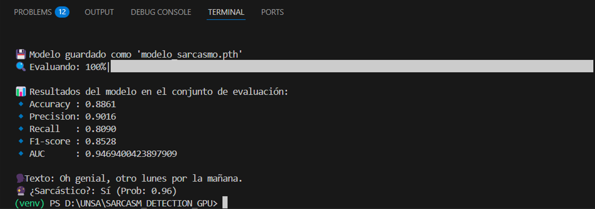

# IMPLEMENTACION_PFC

# Detección de Sarcasmo en Español

Este proyecto tiene como objetivo entrenar y evaluar modelos de lenguaje para la detección automática de sarcasmo en textos en español utilizando modelos basados en transformers.

## Cambios realizados

### Cambio de base de datos

Se ha reemplazado el dataset anterior realizado con semval por uno nuevo más adecuado para el idioma español:

- **Nuevo dataset**: [`Ernesto-1997/Sarcastic_spanish_dataset`](https://huggingface.co/datasets/Ernesto-1997/Sarcastic_spanish_dataset)
- **Ventajas**:
  - Dataset público y disponible en Hugging Face.
  - Enfocado en ironía y sarcasmo.

### Modelos probados

Se probaron dos variantes de modelos preentrenados en español para evaluar el rendimiento en la tarea de detección de sarcasmo:

---

#### Modelo 1: **BETO** (BERT-base en español)
- Repositorio: [`dccuchile/bert-base-spanish-wwm-uncased`](https://huggingface.co/dccuchile/bert-base-spanish-wwm-uncased)
- Arquitectura: `AutoModelForSequenceClassification`
- Tipo: modelo estándar sin capas adicionales (no RNN).
- Salida: 1 solo logit → función `BCEWithLogitsLoss` para clasificación binaria.

---

#### Modelo 2: **BERTUIT** (Robertuito-base uncased)
- Repositorio: [`pysentimiento/robertuito-base-uncased`](https://huggingface.co/pysentimiento/robertuito-base-uncased)
- Arquitectura: `AutoModelForSequenceClassification`
- Tipo: modelo compacto preentrenado para español con buena cobertura de lenguaje informal.
- También se usó sin capas adicionales (sin RNN).

---

## Entrenamiento

- Ambos modelos fueron entrenados usando la misma arquitectura de entrenamiento:
  - `BCEWithLogitsLoss` con `pos_weight` para manejar desbalanceo.
  - `Adam` optimizador.
  - Evaluación con métricas: accuracy, precision, recall, F1, AUC.
- Divisiones: 80% entrenamiento, 10% validación, 10% prueba.

---

## Evaluación

Cada modelo fue evaluado usando el mismo conjunto de prueba con métricas estándar para comparar su rendimiento en la clasificación binaria (sarcasmo vs no sarcasmo).

